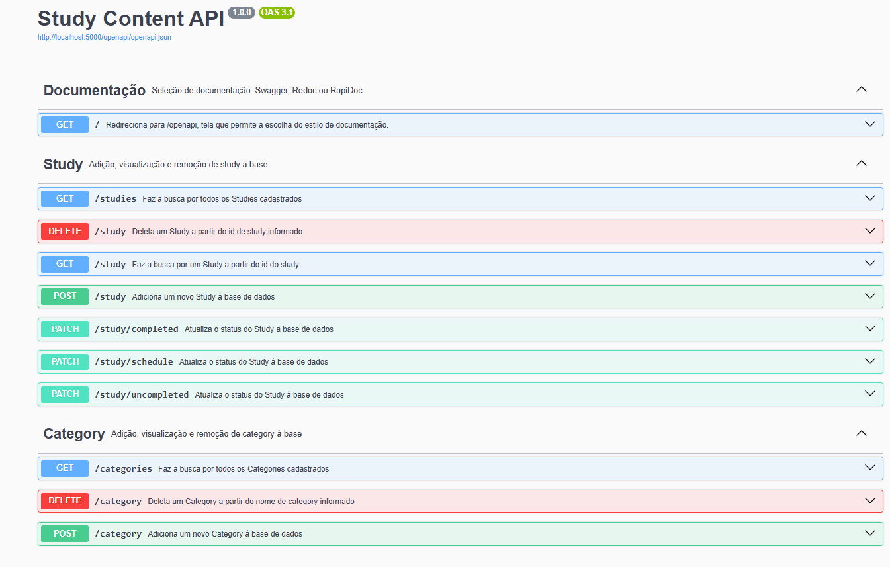
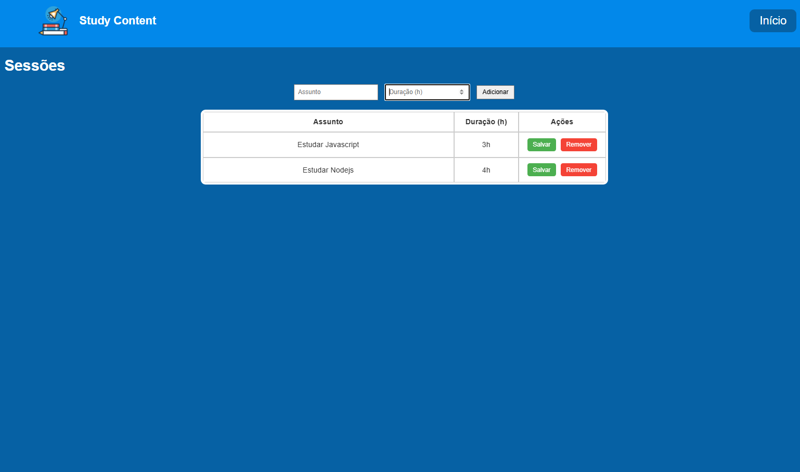
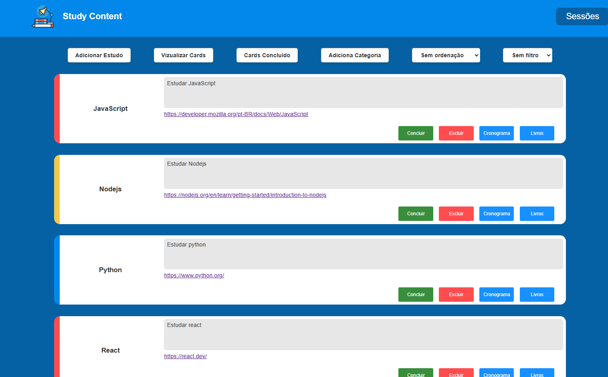

# 📚 Study Content API

API desenvolvida em **Python + Flask** com banco de dados **SQLite**, feita para organizar e acompanhar seus estudos através de **cards interativos**, **categorias** e **sessões de estudo**. Ideal para quem quer visualizar, organizar, marcar como concluído e gerar cronogramas de estudo via integração com IA.

## 🚀 Tecnologias Utilizadas

- Python 3.12
- Flask
- SQLite
- Swagger para documentação da API

---

## 📌 Funcionalidades da API

### 🔍 **Documentação Interativa**
- Disponível via Swagger, Redoc e RapiDoc
- Rota: `GET /`

### 🎓 **Study**
- `GET /studies` → Lista todos os estudos
- `GET /study` → Busca estudo por ID
- `POST /study` → Cria um novo estudo
- `PATCH /completed` → Marca estudo como concluído
- `PATCH /uncompleted` → Reabre um estudo
- `PATCH /schedule` → Atualiza o cronograma gerado por IA
- `DELETE /study` → Remove um estudo por ID

### 🗂️ **Category**
- `GET /categories` → Lista todas as categorias
- `POST /category` → Adiciona uma nova categoria
- `DELETE /category` → Remove uma categoria por nome

---

## 🖼️ Interface Web

### 📑 Swagger UI
Documentação completa da API:


### 🕒 Sessões de Estudo
Adicione sessões com duração definida para cada tópico:


### 📋 Cards de Estudo
Visualização limpa e intuitiva com cards coloridos, categorias e botões de ação:


---

## ⚙️ Como rodar o projeto localmente apenas a API - individualmente

Será necessário ter todas as libs python listadas no `requirements.txt` instaladas.
Após clonar o repositório, é necessário ir ao diretório raiz, pelo terminal, para poder executar os comandos descritos abaixo.

> É fortemente indicado o uso de ambientes virtuais do tipo [virtualenv](https://virtualenv.pypa.io/en/latest/installation.html).

```
(env)$ pip install -r requirements.txt
```

Este comando instala as dependências/bibliotecas, descritas no arquivo `requirements.txt`.

Para executar a API  basta executar:

```
(env)$ flask run --host 0.0.0.0 --port 5000
```

Em modo de desenvolvimento é recomendado executar utilizando o parâmetro reload, que reiniciará o servidor
automaticamente após uma mudança no código fonte. 

```
(env)$ flask run --host 0.0.0.0 --port 5000 --reload
```

## ⚙️ Como rodar o projeto inteiro 

```
(env)$ docker compose up --build
```

Acesse no navegador:
- Swagger: [http://localhost:5000/openapi](http://localhost:5000/openapi)

---

## 📅 Futuras Melhorias

- Sistema de autenticação de usuários
- Integração com Google Agenda
- Dashboard com estatísticas de estudo

---

## 🎥 Demonstração do Projeto

Confira o vídeo de apresentação do projeto no YouTube:  
🔗 [https://www.youtube.com/watch?v=ZLq17Gpz654&ab_channel=BeatrizTavares](https://www.youtube.com/watch?v=ZLq17Gpz654&ab_channel=BeatrizTavares)
